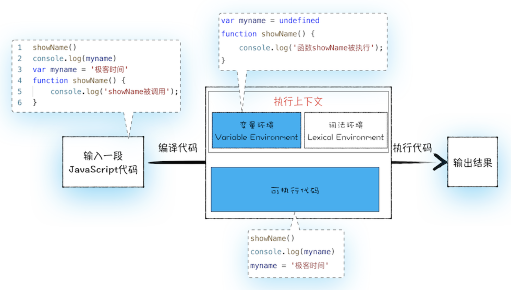
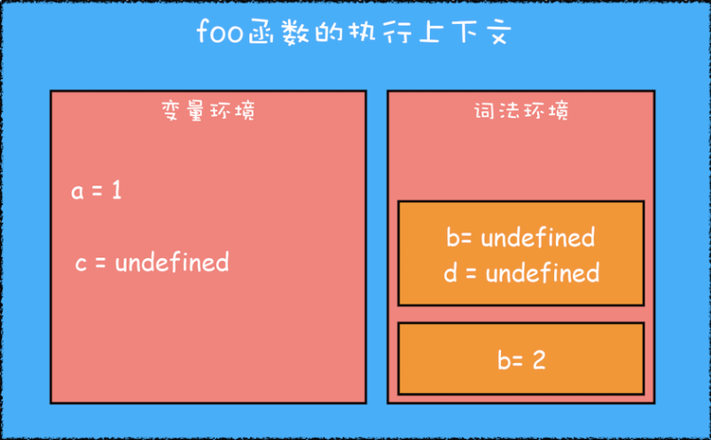
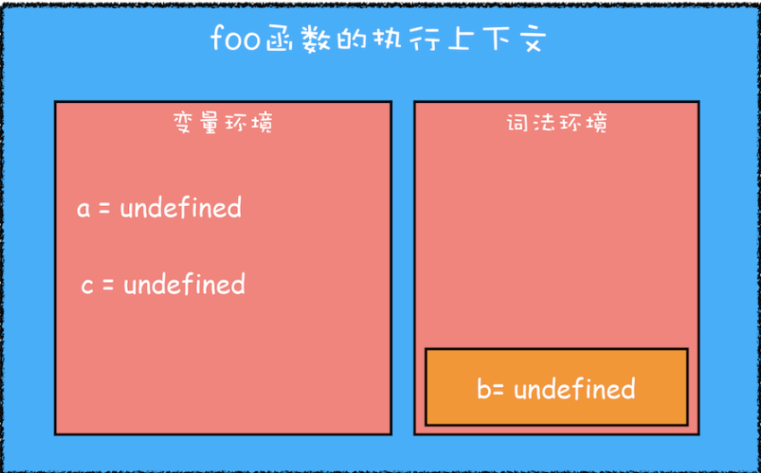
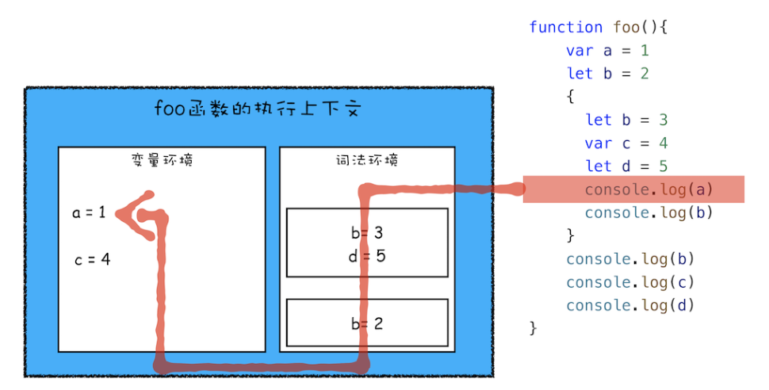

# 编译阶段

当输入一段js代码时，首先进入编译阶段，编译阶段会将我们的js代码编译为执行上下文和可执行代码两部分，编译阶段会将变量和函数的声明放到内存中。

## 执行上下文

执行上下文就是js代码在运行时的上下文环境，比如我们在调用一个函数时，会进入这个函数的内部，这个函数内部就是这个函数的执行上下文，在这个上下文中，就可以确定函数执行期间用到的this、变量、对象和函数等。

执行上下文中又包含变量环境和词法环境两部分。我们在编译阶段遇到的变量var声明和函数function声明都会通过变量提升，将变量的值默认为undefined，函数声明是将函数定义存储在堆内存中，再在环境对象中创建一个函数声明的名称作为属性值，将这个属性值指向堆内存中的函数定义，这就生成了变量环境。

而词法环境就是在编译阶段遇到let和const声明的变量或常量，会放在词法环境中，而函数的作用域块内部，通过let和const定义的变量和常量会在函数执行的时候，在词法环境中创建一个单独的区域，用来存放这一函数内部所有通过let和const定义的变量和常量。

```javascript
function foo(){
    var a = 1
    let b = 2
    {
      let b = 3
      var c = 4
      let d = 5
      console.log(a)
      console.log(b)
    }
    console.log(b)
    console.log(c)
    console.log(d)
}
foo()
```


> 执行上下文并不是所有的代码都会生成执行上下文，有三种情况：
>
> - 全局上下文，当js代码执行全局代码的时候，会编译全局代码并创建全局上下文，在整个页面的周期内，全局上下文只有一个。
>
> - 函数局部上下文，当调用一个函数时，执行函数内部逻辑，此时就会编译函数内部代码，在函数内部存在变量提升等操作，并且在该函数中会创建局部上下文，当函数调用完成，这个上下文就会被销毁。
>
> - 使用eval函数的时候，eval代码也会被编译，并创建执行上下文。
>
>   > eval()函数可以接收一个字符串作为参数，将这个参数作为脚本来执行。
>   >
>   > 缺陷：
>   >
>   > - eval是有安全性问题的，由于他会直接执行字符串中的内容且不可预测，因此如果注入了恶意代码，会直接执行。
>   >
>   > - eval性能低，现代浏览器中有两种编译模式，fast path和slow path，fast path编译那些稳定且可预测的代码的，eval并不是可预测的安全代码，因此使用slow path编译，编译时间会很慢。
>   > - eval不可调试，在开发者工具中无法打断点调试。

## 调用栈

js引擎就是使用执行栈这个东西来管理执行上下文的，在执行上下文创建好后，就会将其压到栈中，管理执行上下文的结构就是调用栈。

### 调用栈的工作流程

```javascript
var a = 2
function add(b,c){
  return b+c
}
function addAll(b,c){
var d = 10
result = add(b,c)
return  a+result+d
}
addAll(3,6)
```

在上述代码中，调用栈的工作流程是这样的：

- 第一步，创建全局上下文，将全局上下文压入栈中；其中变量a，add函数，addAll的声明都放在了全局上下文的变量环境中；其中a的值赋予undefined；
- 第二步，全局上下文创建好后，就开始执行上下文，首先a的值赋值为2，然后执行到addAll函数的调用上；
- 第三步，调用addAll函数，此时js引擎就会对这个函数进行编译，生成addAll函数的执行上下文；然后将addAll函数上下文压入栈中；addAll函数中的变量d和result赋值为undefined。
- 第四步，创建好后就开始执行addAll，将d的值赋值为10，对result值赋值时，发现调用了add函数，因此js引擎会对add函数进行编译，生成add函数的执行上下文，然后将add函数上下文压入栈中。
- 第五步，创建好后执行add函数，返回后add函数上下文就会弹出调用栈，并将返回的值赋予result；
- 第六步，紧接着addAll函数执行最后的return，返回值后，将addAll函数上下文弹出调用栈，此时调用栈中就只剩下了全局上下文，至此，调用栈流程结束。

### 栈溢出

当超出栈的最大深度空间时，就会出现栈溢出情况，最常见的栈溢出现象就是递归，防止递归导致栈溢出的方法可以添加定时器等异步方法，在执行到异步方法时，调用栈会将回调函数（递归的函数）转交给异步线程处理，此时递归函数就会认为执行完毕，就会出栈，则栈就会清空。而交给异步线程处理的递归函数就会被发送到任务队列中，等待eventLoop事件循环将其捞出，执行完毕后重新压入到执行栈中。

> 栈的深度大概是12574条

## 作用域

作用域函数与变量的可访问范围，这个范围决定了该变量的生命周期，与执行上下文不同的是，作用域是一个词法环境。

### JS如何支持块级作用域的

```JavaScript
function foo(){
    var a = 1 // var 定义
    let b = 2
    {
      let b = 3
      var c = 4 // var 定义
      let d = 5
      console.log(a)
      console.log(b)
    }
    console.log(b)
    console.log(c)
    console.log(d)
}
foo()
```

- 首先第一步，先编译并创建一个foo函数的执行上下文；

  - 将函数内部通过var定义的变量都放到变量环境中；

  - 通过let和const定义的变量都放到词法环境中；如果函数中存在其他作用域块，则函数的作用域块内部声明的let或const变量不会放到词法环境中。

    

- 第二步，执行代码；

  - 从上到下执行时，首先会给函数作用域之前声明的变量赋值，var声明的变量赋值到变量环境中，let声明的变量赋值到词法环境中；

  - 当进入到函数的作用域块时，作用域块中通过let声明的变量，会被存放在词法环境中一个单独的区域中，这个区域中的变量并不影响作用域块外面的变量。

  - 

  - 其次在词法环境中，维护一个小型的栈结构，栈底是函数最外层的变量，进入一个作用域块后，就会将这个作用域块压到栈顶，等到这个作用域块执行完成后，这个作用域块会从栈顶弹出。

  - 当执行到函数作用域块中的内容时，比如console.log(a)，就需要在词法环境和变量环境中查找这个变量a，查找顺序为：从该变量所在的函数作用域块所在栈中的位置开始，在栈中自上而下查询，如果在词法环境中某个块找到了，则直接返回给JavaScript引擎，否则继续在变量环境中查找，如果最终都未找到，则抛出错误。
  


- **js引擎执行方式：**块级作用域与变量提升相结合：块级作用域就是词法环境的栈结构来实现的，而变量提升就是变量环境来实现的。

### 临时性死区

**let或const变量在创建到赋值之前的时间为临时性死区，在这个过程中如果被调用，就会抛出错误。**

变量在上下文的存在过程分3个阶段：

- 创建：在环境上下文中创建一个该名称的变量，并为其分配内存空间；
- 初始化：将该变量初始化为undefined；
- 赋值：为该变量赋值。

其中，在编译时，会创建和初始化，但是对于let和const创建的变量只有创建步骤，并没有初始化的过程的，也就是说在创建到为其赋值之前这段时间，是不可被调用的，这段时间被称为临时性死区，如果被调用了，就会跑出错误：Uncaught ReferenceError: Cannot access 'myname' before initialization。

> 【var】编译时，会创建和初始化
>
> 【let】编译时，会创建，不会初始化
>
> 【function】编译时，会创建、初始化和赋值

## 可执行代码

在编译阶段，所有不需要变量提升的代码都会被编译为字节码，就是我们的可执行代码。

# 执行阶段

js引擎开始执行可执行代码，按顺序往下执行，当执行到变量和函数时，js引擎就会去变量环境中查找这个变量和函数。
