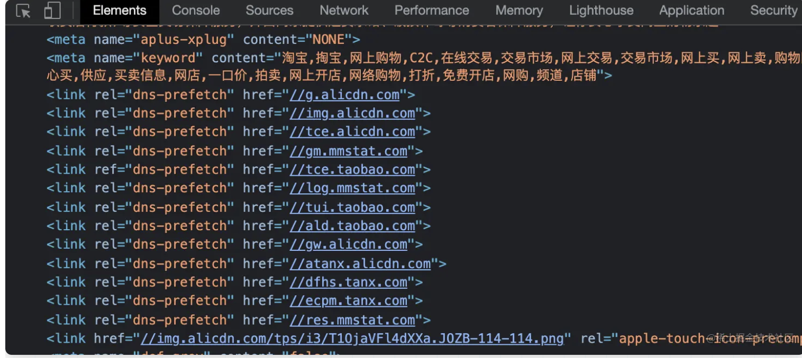

https://juejin.cn/post/6935232082482298911#heading-1

# 缓存
在请求之前首先浏览器会先查看是否存在本地缓存或者本地缓存是否失效，如果没有失效，则直接进行渲染【**策略：强缓存**】；如果本地缓存失效，则浏览器就会使用网络进程发起网络请求。

在向服务器发起请求时，浏览器询问服务器，是否资源真的已经更新了，如果资源已经更新，那么服务器会返回最新的资源和缓存标识；如果资源未更新，则服务器会告知浏览器，可以直接使用缓存中的内容【**策略：协商缓存**】。

## 强缓存与协商缓存策略

强缓存是指浏览器在发起请求之前查看本地缓存的资源,根据本地缓存的失效与否决定是否使用本地缓存的策略，强缓存有两种形式：expires和catch-control，expires标识的是资源失效的时间，catch-control标识的是资源从失效的最长时间段；

协商缓存是指当浏览器的强缓存失效后，浏览器会发起请求询问服务器资源是否已经更新，如果未更新，服务器会返回状态码为304，告知浏览器资源未更新，可以直接使用缓存中的资源；如果资源已经更新，服务器会返回最新资源及最新的缓存标识给浏览器，浏览器的网络进程获取到资源，将资源返回给浏览器进程；

## 协商缓存浏览器与服务器是如何交互的？
当浏览器未命中强缓存时，向服务器发起资源请求，在请求头上，浏览器会将上一次服务器返回最新资源时返回的Etag标识及最后的修改时间LastModified作为请求头信息：if-none-match和if-modified-since的值，发送给服务器，服务器接收到后，会对比if-modified-since的值与资源最后的修改时间LastModified，对比if-none-match的值与服务器对资源生成的Etag值是否一致，如果都没有变化，则返回304状态码，告知浏览器资源未更新，可以直接使用缓存；如果有变化，则返回状态码200，并返回新的资源和新的缓存标识；浏览器接收到将缓存标识更新，并将新的资源交给浏览器进程进入下一阶段。

# 数据传输 —— TCP/IP

在主机A向主机B传输数据,主机A想要发送的数据包中需要携带主机B的IP地址，这样数据包才能正确的寻址，找到对应的主机B；
其次，数据包中也要携带主机A本身的IP地址，这样在主机B才能回复信息给主机A。而通过域名获取IP地址的阶段就是DNS域名解析阶段【详情参考浏览器及网络内容】

但是光有IP地址是不够的，IP地址只负责将数据包发送给对方的电脑，但是并不知道需要给对方电脑的哪一个应用程序。因此，需要基于IP地址之上，需要使用可以和应用程序打交道的协议，也就是UDP和TCP协议.

UDP中的端口号可以指定具体传输到的应用程序。因此在传输数据包时通过IP地址信息把数据包发送给指定的电脑，通过UDP的端口号，将数据包发给指定的应用程序。

- 主机A在应用层将数据包传给传输层
- 传输层会在数据包前面附加UDP的请求头，组成新的UDP数据包，再将新的UDP数据包传给网络层。

> UDP头包括主机A的端口号【源端口号】和主机B的端口号【目标端口号】

- 网络层会在UDP数据包的前面附加IP请求头，组成新的IP数据包，将数据传给底层。

> IP头是IP数据包开头的部分，包括IP版本、主机A IP地址【源IP地址】、主机B IP地址【目的主机IP地址】、生存时间等信息

- 数据包就会被底层【物理介质】传给主机B的网络层，在这里会将IP头信息拆开，根据IP地址信息，并把数据部分传输给传输层
- 在传输层，会将UDP头信息开发，根据UDP中的端口信息，将数据部分传给上一层的应用程序
- 最后主机A传送的数据包就传送到了主机B的对应应用程序中。

> UDP协议是不可靠的、易丢包、速度快的传输协议，因此通常使用UDP协议作为视频、互动游戏等资源的数据传送。对于网页的渲染和邮件等需要保证数据传输可靠性的情况，一般是使用TCP协议传输协议。TCP协议是一种面向连接的、可靠的字节流协议。
>
> 对于丢包问题，TCP有重传机制，在发起数据包传输时，如果对方接收到数据包，会发送确认收到的消息，如果发送方迟迟没有收到确认消息，则会认为丢包，就会重新发送数据包，避免丢包。
>
> TCP在每一个数据包头部携带了用于排序的序列号，这样在接收端就可以保证接收端通过序列号进行排序，从而组成完整的文件。

TCP传输数据过程与UDP类似，只不过在拼接TCP头时，额外添加了序列号保证数据传输的完整性。

TCP与UDP最大的不同就是他是一个面向连接的可靠协议，因此为了数据传输的可靠性，TCP需要建立传输通道。

TCP连接的整个过程如下：

- 首先就是三次握手建立连接，保证客户端和服务端都已经做好发送和接收数据的准备。【三次握手详见浏览器及网络篇章】
- 其次，建立好连接后进行数据的传输，每次发送端将数据发送给接收端，接收端接收到数据都会返回一个确认收到的消息，告知发送端消息成功接收，如果在规定时间内发送端没有收到确认消息，则会认为该数据包丢失，并触发重传机制。一个大的数据包在发送之前会切分成最小单元的数据包，每一个数据包都会有序列号，这样在接收端就会根据序列号将数据排序成一个完整的文件。
- 最后，就是连接的断开，数据传输完毕后，终止连接，通过四次挥手断开TCP的连接通道【四次挥手详见浏览器及网络篇章】。

# 浏览器端发起HTTP请求

发起HTTP请求过程主要分为以下几个步骤：

## 查找缓存

在发起真正的请求之前，浏览器先从本地的缓存中查找是否存在要请求的文件，如果存在，则会拦截请求，返回该本地资源，并直接结束请求，不会向源服务器发起请求。这样会减少服务器的压力，并且可以快速进行资源的加载。

> 缓存又分为强缓存和协商缓存两种形式，具体的详见浏览器及网络篇章中。

## 准备IP地址和端口号

当浏览器向服务器发起请求时，使用的是HTTP协议，而HTTP协议是应用层协议，用来封装文本信息，其本身并不存在连接的概念，只有响应和请求，所以HTTP是需要依赖于TCP/IP作为传输层协议将数据发送到网络上。

所以HTTP在请求之前，浏览器需要通过TCP与服务器建立连接。因此可以说：**HTTP是通过TCP这个传输通道来传输数据的。**

- 当发起网络请求时，首先第一部就是建立TCP的连接，在建立TCP连接时，首先就要知道IP地址和端口号，这样才可以正确的找到发送请求的目标服务和服务上对应的应用程序。

- 每一个服务器网站都会有IP地址，只不过IP地址是一串数字，数字难以理解和记忆，因此我们在请求的时候都是通过协议+域名+端口号+路径及参数组成的url进行访问的，其实呢IP地址和域名之间是有着映射关系的，那么处理该映射关系的服务就是我们常说的域名系统【Domain Name System（DNS）】

- 所以想要根据url获取IP地址，就需要先进行域名的解析，查找该url所对应的IP地址是什么，因此开始进行DNS域名解析。

> ### DNS域名解析
>
> 在发起请求之前，由于浏览器是无法根据url地址的域名地址访问到对应的服务器的，每一个服务器都会对应一个IP地址，所以需要将域名解析为IP地址，这个过程就是DNS域名解析过程。
>
> DNS域名解析其实是查询的过程，浏览器向本地DNS服务器发起访问请求,本地DNS服务器查找并返回对应服务器的IP地址的过程。查询过程分为递归查询和迭代查询两大部分：
>
> > 本地DNS服务器指的是每一个ISP（运营商）都有一个本地的DNS服务器，比如一个社区的ISP、一个大学的ISP、一个机构的ISP，都会有一台或者多台DNS服务器，当本地的客户端发起DNS请求时，该请求都会发往本地DNS服务器。
>
> 当本地DNS服务器接收到浏览器的请求后，就会首先在本地缓存中查看是否存在该域名的IP地址，如果存在则返回；如果不存在，则查询操作系统中是否存在，如果存在，则返回，不存在，则查询是否路由器等设备上是否存在该IP地址，一层层查找，直到找到后返回给浏览器，这个过程为递归查询。
>
> 当缓存内都不存在，本地的DNS服务器就会代替浏览器向其他域名服务器访问，当向根域名服务器访问时，根域名服务器会返回对应顶级域名的ip地址，告诉DNS服务器去顶级域名询问是否存在；顶级域名就会告诉下一阶段域名的IP地址，告诉DNS服务器询问是否存在需要访问的域名地址，一直到DNS服务器找到；
>
> 在DNS服务器询问根域名、顶级域名并拿到对应信息再进行下一个步骤，直到找到对应服务器的IP地址的过程为迭代查询。DNS服务器拿到域名IP地址返回给浏览器的过程为递归查询。
>
> 本地DNS服务器拿到IP后会将其返回给浏览器并将IP地址放在缓存中。
>
> 

>DNS缓存包括浏览器缓存、本地DNS服务器缓存、操作系统缓存、路由器缓存、根域名服务器缓存、顶级域名服务器缓存、主域名服务器缓存

> ### DNS负载均衡
>
> 负载均衡是指在我们在网站中可能会发起大量的请求，如果所有的请求都打到一个服务器上，则这台服务器的压力会很大,响应速度慢，甚至可能会崩溃，因此当一个网站有多个服务器地址时，在应答DNS查询的时候，DNS会对每一个查询返回不同的结果，这样就会将资源分散到不同的服务器上，达到负载均衡的效果。比如可以根据每台机器的负载量以及该机器对于用户的物理距离等条件；比如CDN其实就是通过DNS的负载均衡，将距离该url最近的节点的IP地址返回给浏览器，浏览器在请求资源时，就会自然请求到最近的这个节点中的资源。
>

> ### DNS**预解析**
>
> DNS预加载【pre-load，提前加载DNS资源，将其缓存在缓存中】和预连接【pre-connection 是预解析和TCP连接一起的统称，也就是提前进行DNS的解析，解析后进行TCP的三次握手，将DNS解析和TCP三次握手的连接状态均缓存到本地中，等待资源的请求】
>
> DNS预解析主要是在浏览网页时，对网页中需要进行DNS解析的域名优先进行DNS的解析和缓存，从而达到减少响应时间,提高用户体验的作用。
> 比如有很多大型网站，需要很多不同服务器的域名的资源，就可以配置DNS预解析 rel="dns-prefetch",提前解析,减少页面卡顿。
> 
>
> <!--**在整个过程中什么时候解析呢?**-->
>
> 当资源解析这个资源文件的时候，当遇到对应的域名直接进入DNS的预解析，将解析出来的资源缓存到本地，当资源正式请求或后续存在相同域名的资源时，直接取本地的IP资源。

- 拿到IP之后，接下来就是端口号，通常情况下，如果url上没有特别指定端口号，那么端口号默认就是80.

## 等待TCP队列

由于浏览器中有一个机制，同一个域名同时最多只能建立6个TCP连接，如果在同一域名下同时有超过6个请求发生，那么超过6个的部分就会进入等待状态，直到进程中的请求完成，再进入到队列中。

如果未超过6个，则直接建立TCP的连接。

## 建立TCP连接。

客户端和服务端在进行数据传输的过程中，由于HTTP不存在连接的概念，他只有请求和响应，因此需要建立一个用来承载http的数据包传送的通道，这个通道就是TCP connection。

标记位：

- 建立连接【synchronse】：SYN
- 确认【acknowledge】：ACK
- 传送【push】：PSH
- 结束【finish】：FIN
- 重置【reset】：RST
- 紧急【urgent】：URG

 - 第一次握手：主机A发送位码为SYN＝1，随机产生Seq  number=1234567的数据包到服务器，主机B由SYN=1知道，A要求建立联机；（第一次握手，由浏览器发起，告诉服务器我要发送请求了）
 - 第二次握手：主机B收到请求后要确认联机信息，向A发送ack number=(主机A的seq+1)，SYN=1，ACK=1234567 + 1，随机产生Seq=7654321的包；（第二次握手，由服务器发起，告诉浏览器我准备接受了，你赶紧发送吧）
 - 第三次握手：主机A收到后检查ack number是否正确，即第一次发送的seq number+1，以及位码SYN是否为1，若正确，主机A会再发送ack number=(主机B的seq+1)，ack=7654321 + 1，主机B收到后确认Seq值与ACK=7654321+ 1则连接建立成功；（第三次握手，由浏览器发送，告诉服务器，我马上就发了，准备接受吧）

> 为什么一定要三次？这是TCP特性所决定的，TCP是面向连接的、可靠的字节流传输协议，所以为了满足可靠性，第一次是客户端向服务器发起，实际上确定了客户端发起功能正常，第二次是服务器返回给客户端告知客户端已经收到消息，实际上确定了服务端的接收和发送功能；第三次是客户端向服务器发送已经收到的确认消息，确定客户端的接收功能正常。

## 发送HTTP请求

建立TCP连接后，浏览器和服务器就可以进行通信了，这个时候就可以传输HTTP数据了。

首先，浏览器先发送一个请求行给服务器，告诉浏览器他需要什么资源。比如get方法，就直接告诉服务器我要我url请求的这个资源。

如果是post等需要传参的方法，则传参的数据放在请求体中。

> 请求行中的内容包括请求方法『get、post』请求URI【统一资源标识符：该标识允许用户对任何的资源通过特定的协议进行交互操作】、协议的版本。

其次，浏览器发送请求头，告诉服务器本地的域名、连接方式、缓存信息以及浏览器使用的操作系统、浏览器内核等信息以及浏览器端的cookie等.

# 服务器端处理HTTP请求

## 返回请求

服务器处理结束，就会将数据返回。

首先服务器返回一个响应行，响应行中包含HTTP协议版本、状态码；服务器通过状态码告知浏览器它处理的结果。

接着服务器返回响应头，包含数据的类型、连接类型以及服务器想要存储在浏览器端的缓存信息（如协商缓存标识及cookie信息等）

当第一次请求时，服务器的响应头中会携带Cache-Control:max-age，告诉浏览器缓存的最大超时时间，在这个时间内可以使用缓存。

发送完响应头，返回响应体。

## 断开连接

默认情况下，当服务器返回给浏览器数据后，TCP四次挥手确认双方都不再收发数据后，TCP连接就会断开。

但是为了保证数据在一定时间内可以连续传输，所以需要浏览器和服务器通过一个字段标识连接一直保持：connection: keep-alive.

> TCP的四次挥手是客户端和服务端断开相互连接的必要过程。
> 
>
> - 第一次挥手：客户端向服务端发起请求断开连接的消息，并带有标识位FIN=M。此时客户端进入等待关闭状态，说明没有数据传输给服务器了。
>
> - 第二次挥手：服务器端接收到消息后，向客户端发送确认消息，并带有标识位ACK=M+1;
>
> - 第三次挥手：服务端再向客户端发起请求断开连接的消息，并带有标识位FIN=N。
>
> - 第四次挥手：客户端接收到消息后，向服务端发送确认断开的消息，并携带标志位ACK=N+1.
>
> - 服务端收到客户端的确认消息后，就断开连接；客户端等待2MSL未再收到服务器消息后，确认服务端已断开连接，客户端此时断开连接。
>
>   > 2MSL是报文段最大生存时间，它是任何报文段被丢弃前在网络内的最长时间。

## 重定向

当我们在浏览器中输入test-m.gaotu.cn时，浏览器会自动跳转到test-www.gaotu.cn，这就是重定向，服务器通过状态码302告诉浏览器我们访问的地址需要重定向到另一个网址，而需要重定向到的网址就是返回信息中Location所标识的。

这时，浏览器就会获取Location的地址，重新导航。

## 用户的登录态是如何保持的？

- 用户在浏览器中输入用户名和密码，点击提交，浏览器通过post方法将用户数据提交给服务器
- 服务器接收到数据后，查询后台，校验登录信息是否正确。如果正确，就会生成一段标明用户身份的字符串【UID】，并把这个字符串放在响应头中的set-Cookie字段里，然后将响应头返回给浏览器。
- 浏览器在接收到服务器的响应头后，开始解析响应头，如果遇到set-Cookies这个字段，浏览器就会把set-Cookies中的值保存到本地。
- 当用户再次访问时，浏览器会发起HTTP请求，但是在请求之前，浏览器会读取之前保存的值，并把这个值放到请求头中的cookie字段里，传给服务器
- 服务器收到请求头之后，就会解析请求头，查找是否有cookie字段，如果有，服务器就会查询后台，并判断该用户的登录状态，如果已经是登录状态，则返回有该用户信息的页面数据。
- 浏览器接收到有该用户信息的数据后，就可以正常展示用户登录的状态信息了。

## 如果一个页面的加载时间过慢，该如何分析和定位问题？

- 首先猜测可能出现问题的地方：同域名并发的请求是否超过6个；资源包过大，下载时间长；网络环境差，一直在丢包，触发重传机制。
- 其次分别分析和验证：
  - 并发请求是否超过6个：可以查看浏览器的网络资源请求，同时发起几个请求，其次查看项目中拆包数量及优先级排序是否合理
  - 资源包过大：查看浏览器网络资源请求中单个资源的大小，如果过大导致下载速度慢，可以采用拆包、按需加载等方式进行优化。
  - 网络环境差：使用ping命令查看响应时间，看看时延高不高；如果时延比较高，则就要判断是否是网络或者设备出现了问题。

# 解析和构建

# 渲染