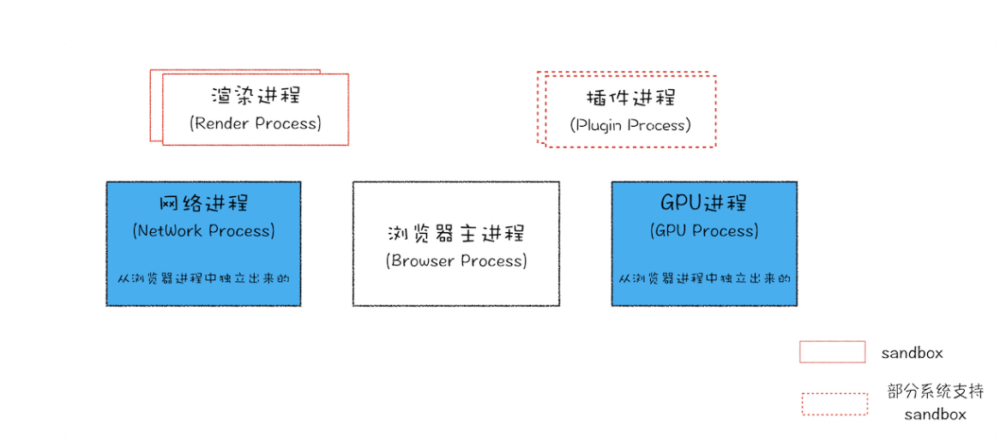

# 浏览器的多进程架构

通常，一个应用就是一个进程，进程与进程之间的数据是相互隔离的；<!--如果想要进行进程之间的通信，使用IPC通信-->，当一个进程关闭之后，系统就会自动回收这个进程所占有的内存资源，进行空间的释放。

进程中有很多线程，线程是可以并行的，线程之间可以修改和共享进程中的数据；

在一个进程中，如果某一个线程出现崩溃，则会引起整个进程的崩溃。

目前的浏览器进程组成：

> 包括一个浏览器主进程、一个GPU进程、一个网络进程、多个渲染进程和多个插件进程。

浏览器主进程：主要是负责界面的展示、用户交互以及其他进程的管理，同时提供存储功能，也就是浏览器的缓存主要存储在浏览器主进程中。

网络进程：主要负责网络请求

GPU进程：主要是网页的UI界面的渲染

渲染进程：主要是进行HTML、CSS、JavaScript的解析和构建，将其转化成用户可以与浏览器交互的网页。排版引擎Blink和V8引擎都是运行在渲染进程中的。浏览器默认每打开一个tab页面就会开启一个渲染进程，这样渲染进程之间互相隔离，即使其中一个tab崩溃，也不会影响其他页面的渲染。由于渲染进程中的数据都是从网络中获取的，所以可能会存在一些恶意代码利用浏览器漏洞对系统进行攻击，出于安全考虑，渲染进程运行在沙箱模式下。

> 沙箱模式是什么？
>
> 我们可以将沙箱模式看做操作系统上的一把锁，沙箱模式中的程序是可以运行的，但是无法在硬盘中写入任何数据，也无法在敏感的位置读取数据，比如文档和桌面。浏览器将渲染进程和插件进程放在沙箱模式下，即使渲染和插件进程中被注入了恶意程序，恶意程序也无法穿过沙箱模式读取系统敏感信息。

插件进程：主要负责插件的运行，由于插件容易崩溃，因此将插件放在单独的进程中，即使插件进程崩溃，也不会影响其他的进程。

浏览器的默认策略是每一个标签打开一个渲染进程，但是如果打开的新页面与其他页面属于同一站点时，那么新的页面就会复用同一站点的渲染进程.所以这种情况下，如果一个页面崩溃了，那么关联的同一站点的其他所有页面都会崩溃。【原因：因为在同一个渲染进程中js进程是共享的，也就是页面之间是存在交互逻辑的】

> 同一站点：
> 同一站点指的是相同协议和相同根域名的网站，即使他们的子域名不同、端口号不同、路径不同，他们也属于同一个站点，比如：https://time.geekbang.org、https://www.geekbang.org、https://www.geekbang.org:8080，他们的协议和根域名都是相同的，因此他们属于同一个站点。

