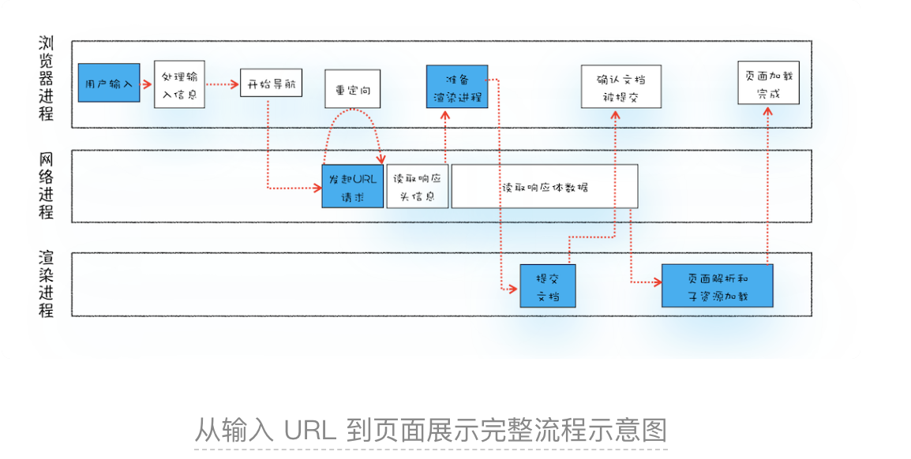
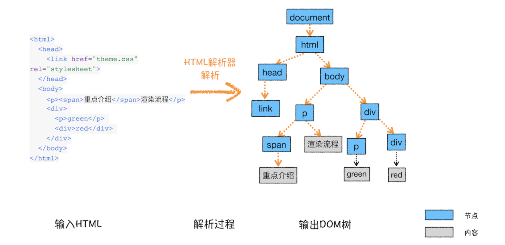
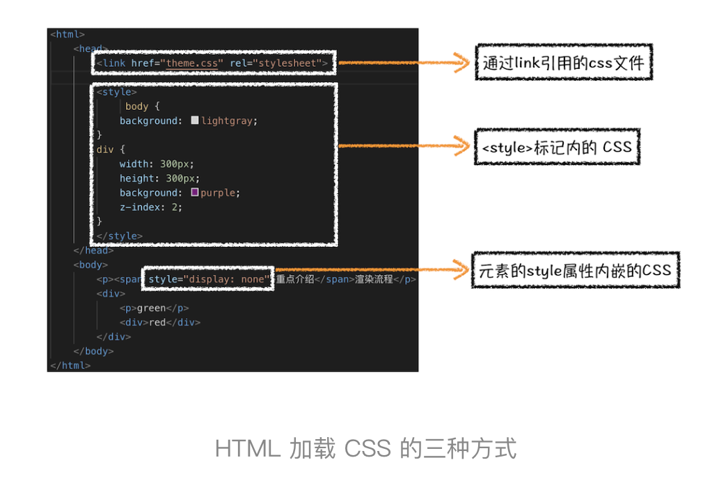
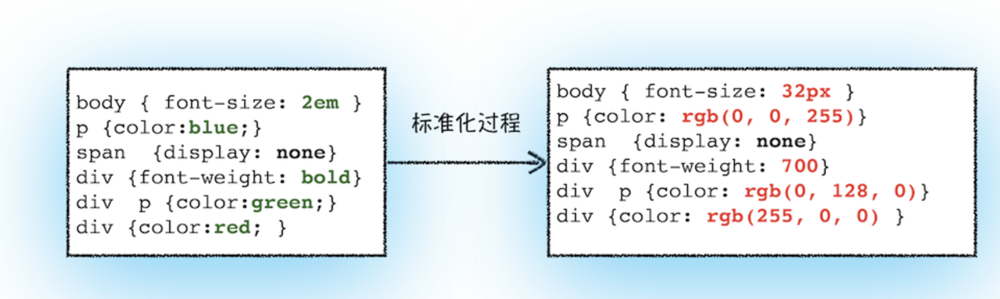
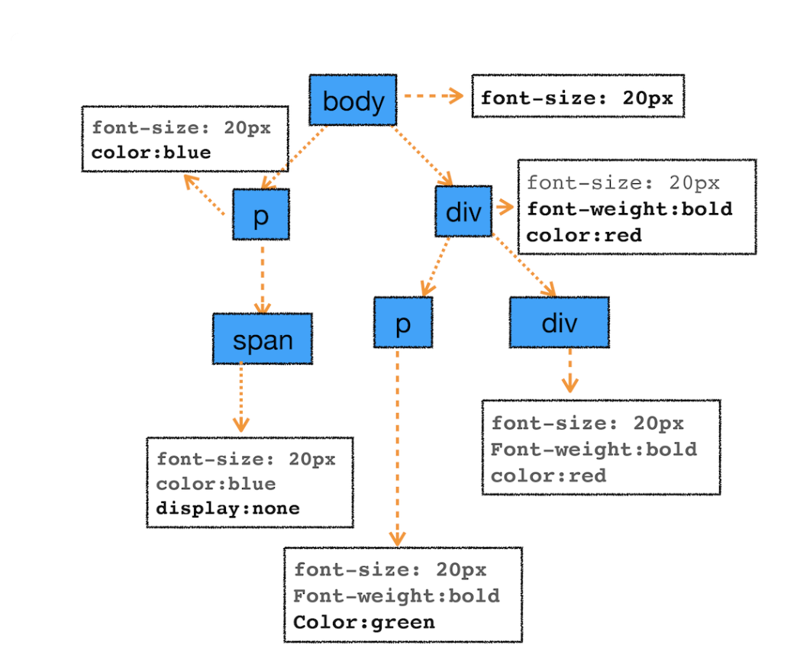
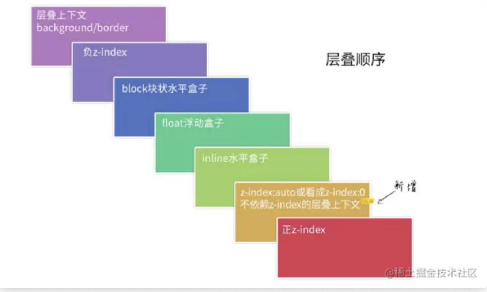
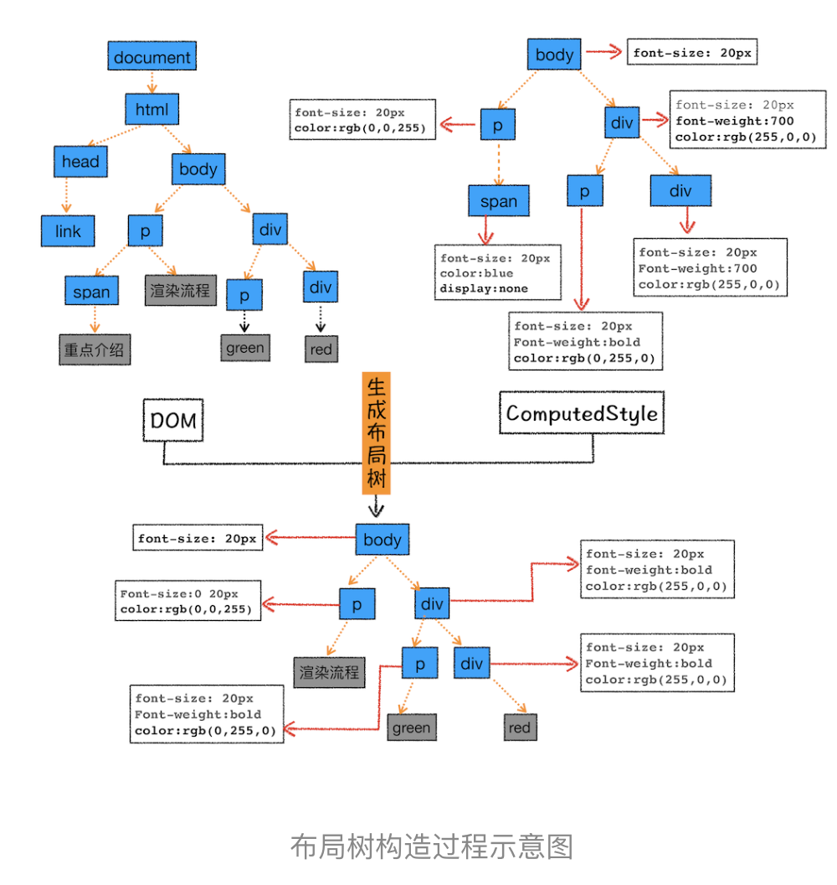
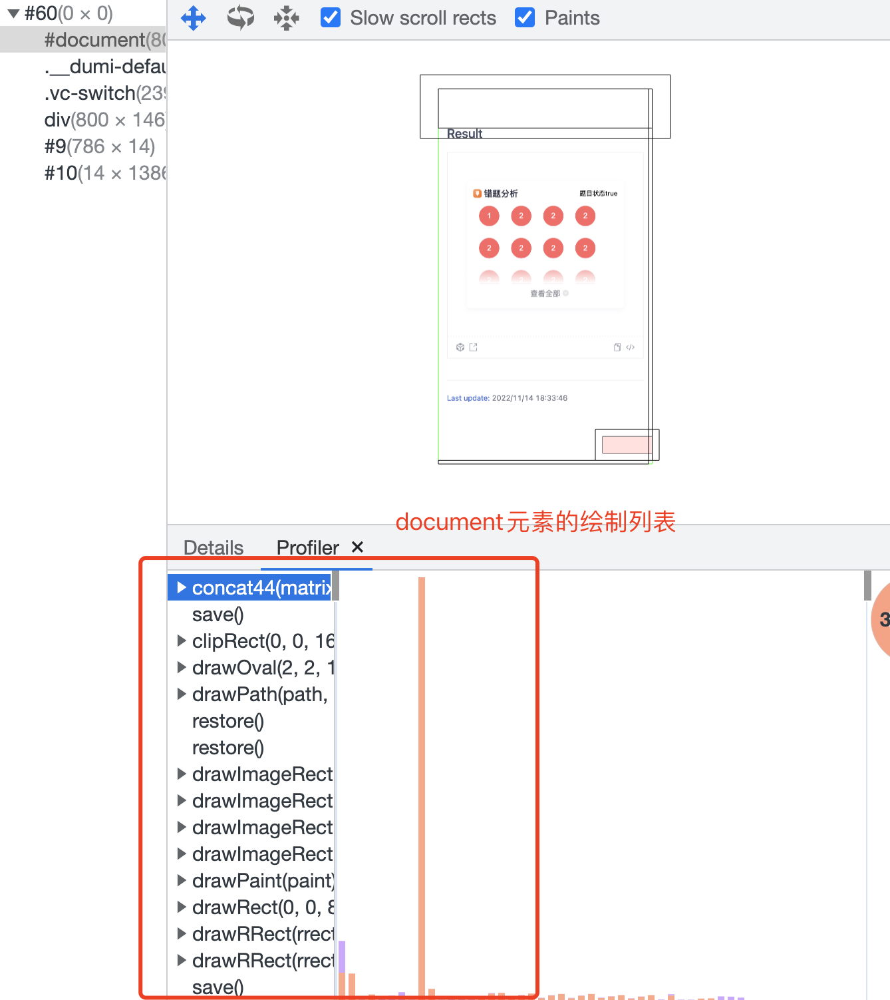
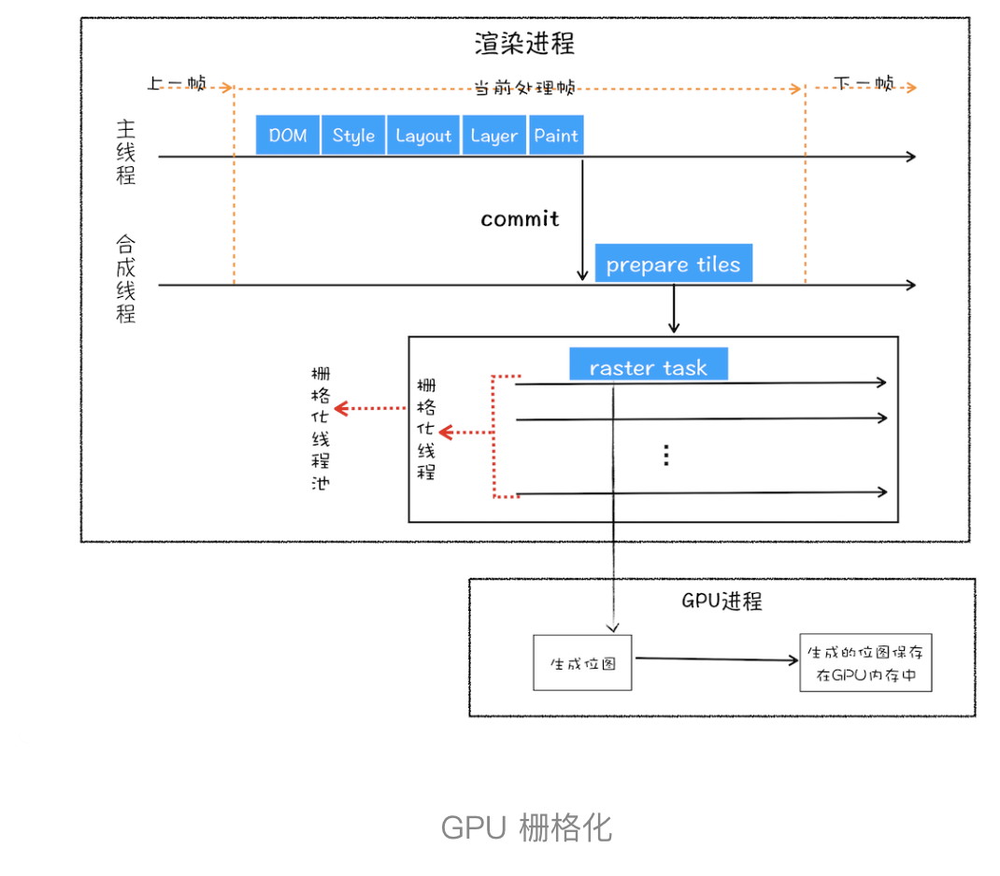

# 用户输入

~~当用户在地址栏中输入一个内容时，地址栏会判断输入的关键字是搜索内容还是请求url；如果是搜索内容，浏览器会使用默认的搜索引擎来合成新的带有搜索内容关键字的url；如果是请求url，则判断是否符合url规则，并加上协议,合成完整的url。~~

用户输入url，浏览器会根据用户输入的信息判断是内容还是网址，如果是内容，就将搜索内容+默认搜索引擎合成新的url；如果输入的内容符合url规则，浏览器会根据url协议，在这段内容上加上协议合成合法的url。

> url内容包括：协议、主机名称、端口号、路径地址、参数和锚点

然后，浏览器的导航栏开始loading状态，此时页面展示还是之前的页面，这是因为新页面的相应数据还没有获得。

# url请求过程

浏览器进程构建请求行信息，通过进程间【IPC】通信将url请求发送到网络进程，网络进程收到后，才会发起真正的url请求。

<!--TODO IPC通信大概是如何通信的-->

> IPC通信中，定义了一个Channel类，封装了具体的实现细节，大概实现是这样的：channel有两种工作形式，一种是Client，一种是Server，Client和Server分属于两个进程，维系着一个共同的管道，Server负责创建管道，Client则负责连接该管道，然后需要通信的进程双方往各自的管道缓冲区中读写数据，完成通信。

## 查找缓存

在发起请求之前，网络进程会查询本地缓存是否缓存了该资源，如果缓存了，且未失效，则网络进程返回缓存中的资源给浏览器进程，拦截请求。否则直接进入网络请求。

## 域名解析

网络进程请求DNS，返回域名对应的IP地址和端口号，如果在之前DNS域名解析服务器缓存过该域名信息，就会直接返回缓存信息，否则，发起请求查询该域名对应的IP地址和端口号，如果没有端口号，则HTTP默认为80端口，HTTPS默认为443端口，如果是HTTPS，还需要建立TLS连接。

~~在请求的前一步，需要进行DNS解析，获取请求域名的服务器的IP地址。如果请求协议是HTTPS，那么还需要建立TLS连接。~~

## 连接服务器

接下来就是使用IP地址通过TCP协议建立服务器的连接。

> TCP有一个机制，同一个域名同时只能建立6个TCP连接，所以如果同一个域名同时发起了超过6个请求的话，那么超过的部分就会进入排队等待状态，直到进行中的请求完成，如果当前请求小于6个的话，则会直接建立TCP的连接。
>

TCP三次握手建立连接 【三次握手过程和一些问题详见浏览器及网络篇章】

- TCP三次握手其实也是TCP三报文握手，每次发送的消息其实都是一个小的数据包，这些数据包中会携带一些数据来标识每个过程要干啥；
- 第一步，浏览器向服务器发送建立连接的数据包，数据包中携带SYN=1和一个随机数Seq = X， SYN = 1是标识建立连接的字段。
- 第二步，服务器收到数据包进行解析，解析后进行数据处理后，返回给浏览器一个响应数据包，数据包中携带SYN=1,ACK = Seq+ 1和随机数Y，告诉浏览器同意建立链接，可以发送数据；
- 第三步，浏览器收到服务器的数据包后进行解析，判断确认消息是否正确，确定正确后向服务器发送收到确认数据包，数据包中携带ACK= Y+1，和随机数seq = Z，告诉服务器确认连接，准备开始发送数据；服务器收到数据包后，确认ack的值正确，则连接建立。

## 发送和接收数据

先说一下网络五层结构。

建立连接之后呢，我们的数据传输主要是根据网络五层结构所传输的，网络五层结构从上到下大概分为应用层、传输层、网络层、数据链路层和物理层，接下来，我将从一个数据包在这五层网络结构里如何传输的过程讲述下。

首先，在应用层，http协议将数据传送给传输层，在传输层在我们的数据包加上TCP头部【包括源端口号、目的端口号还有用于校验数据完整性的序号】，从传输层向下传输至网络层；

网络层在数据包的请求头上加上IP头部【包括源IP地址、目的IP地址】，继续向下传输到底层；

底层通过物理网络介质将数据传输给目的服务主机；

目的服务主机网络层将收到数据包，将IP头部解析出来，识别出数据部分；将解析出的数据部分继续向上传输到传输层；

目的服务主机传输层收到数据包，将TCP头部解析出来，识别端口，将数据部分继续上传到应用层。

应用层中服务器端进行解析请求头请求体，如果需要重定向，则返回响应码为301或302，并在响应头中通过location字段返回需要重定向的地址；浏览器的网络进程会在响应头的location字段中读取重定向地址，然后再发起HTTP请求，从头开始。

如果不是重定向，服务器会根据请求头中的if-None-Match值和if-modified-scince判断资源是否真的更新了，如果资源没有更新，服务器会返回状态码为304，告9.诉浏览器资源未更新，可以直接使用本地资源；如果资源更新了或者请求头上标有no-catch等不缓存的标识，则服务器会返回状态码为200，并返回最新资源，如果想要缓存数据的话，服务器会在响应头上添加catch-Control: max-age = 2000,告诉浏览器本地资源最长的缓存时间。

响应数据就会顺着应用层-->传输层-->网络层-->数据链路层--> 物理层 --> 数据链路层 --> 网络层 --> 传输层 --> 应用层传回到浏览器中。

> 浏览器先向服务器发送请求行信息，告知服务器浏览器的请求方法【get、post】和想要的资源及协议的版本等；然后再发送请求头信息。
>
> 浏览器请求头信息除了浏览器缓存的标识、域名、操作系统、连接的方式及cookie等

<!--TODO： HTTP版本演化的过程，如何在说的时候拓展出来~-->

## 断开连接

数据传输完成，TCP通过四次挥手断开连接。如果浏览器或者服务器在请求头或者响应头上添加ConnectionType：keep-alive，则TCP会一致保持连接。保持TCP的连接可以省下下次建立连接所需要的时间，提升资源的加载速度。

## 准备渲染

在服务器返回的响应头中有一个重要的字段，标识服务器返回数据的类型【content-type】，contentType主要是根据mimeType的标准，如果content-type=application/octet-stream，则说明返回的是字节流的数据类型，浏览器就会判断为下载类型，此时这个数据就会提交给下载管理器，由下载管理器处理，此时url请求就会到此结束；如果cntent-type=text/html，则说明返回的是文本类型，网络进程就会将资源交给浏览器进程。

## 准备渲染进程

浏览器进程会检查当前的url是否和之前打开页面是否是同一站点【根域名和协议相同就认为是同一站点】，如果是，则复用原来的渲染进程，如果不相同，则新开一个渲染进程。

## 浏览器进程将数据提交给渲染进程并显示在浏览器的过程。

- 当浏览器进程接收到网络进程的数据后，便向渲染进程发起『提交文档』的消息。
- 渲染进程收到消息后，就会和网络进程建立传输数据的管道。
- 等文档数据传输完成，渲染进程会向浏览器进程发送『确认收到』消息。
- 浏览器进程收到确认消息之后，就会更新浏览器页面状态，包括安全状态、地址栏url、前后退的历史状态，并更新web页面，此时web页面是空白页
- 渲染进程对文档进行页面解析和子资源的加载。
- HTML通过HTML解析器构建成DOM树，CSS通过计算每一个节点的具体样式和标准化为浏览器可以理解的结构生成StyleSheets保存在ComputedSheets中，然后根据DOM树和styleSheets计算出每一个元素的位置，最后生成一个布局树；然后根据布局树再对需要分层的元素进行分层，生成图层树。然后对每一个图层进行绘制，最终将绘制好的图层进行合并
- 合并后渲染进程提交给浏览器进程，浏览器进程合成一张可展示的图片，显示在浏览器中。

<!--TODO：渲染过程接着学习李冰老师内容，再深入化-->

# 渲染阶段详细过程

渲染阶段根据时间顺序，可以分为以下几个阶段：

### 构建DOM树

由于浏览器无法直接理解和使用HTML，所以需要将HTML转换成浏览器能够理解的结构——DOM树。

构建DOM的输入文件是一个非常简单的HTML文件结构，经过HTML解析器之后，就会自上而下，根据节点的层级结构，生成一套DOM树。

DOM和HTML的内容基本是一样的，他们不同的是，DOM是保存在内存的树状结构，可以通过js来查询或修改其内容。

### 样式计算

样式计算的目的是为了计算出每一个节点的具体样式是什么。

#### 将CSS转换成浏览器能够理解的结构

> CSS来源主要有三个方面：
>
> 1、link中CSS文件的引入。
>
> 2、<style>标签中CSS样式的引入
>
> 3、元素标签中style或className以及styleName的引入

同样，浏览器也无法直接读取和理解CSS样式，所以当渲染引擎接收到CSS数据时，会执行一个转换操作，将CSS文本转换为浏览器可以识别的结构——styleSheets。并且该结构同时具备了查询和修改的功能。

#### 转换样式表中的属性值，使其标准化

在CSS文本中，比如em或者blue等这些并不能被渲染引擎理解的属性值，需要转换成渲染引擎容易理解的、标准化的计算值，如下图所示。【所以，在开发过程中，尽量使用标准化的值，避免渲染进程再进一步做解析】

#### 计算出DOM中每一个元素的具体样式

当属性值标准化后，就开始计算每一个元素的具体样式了。结合CSS继承规则和层叠规则，计算出每一个DOM元素的最终样式，并将其保存在浏览器本地的ComputedStyle结构内。

> CSS继承规则：就是每一个节点都包含其父元素的样式，如果想要更改本身元素的样式，则可以在子元素中重写。
>
> CSS层叠规则：

### 布局阶段

虽然我们已经知道了DOM树以及DOM树中每一个元素的样式，但是我们还不知道每一个元素的几何位置是什么，因此接下来就是计算几何位置的过程，这个过程就是布局。

#### 构建布局树

由于DOM元素中会存在很多不可见的节点，比如link标签、head节点、meta标签以及display: none的不可见节点，因此，在布局之前，我们还要构建一颗只包含可见节点的布局树。

遍历DOM树中的所有节点，将可见节点添加到布局树中，不可见的节点都忽略掉。

#### 布局计算

在执行布局计算的过程中，布局计算的结果会写入到布局树中，也就是布局树既是输入内容，也是输出内容。

> 这个方案并没有对布局的输入和输出内容明确的区分开，*导致当布局树中某一个样式更改或者元素更改后，会导致整个布局树的变更，而布局位置计算也需要重新计算，整个布局树内容就会发生很大的变化*，所以谷歌团队正在重构，试图将布局树的输入和输出内容区分开来，让布局的算法更加简单。

### 分层

布局计算完成之后，还是无法进入绘制页面的流程的，因为页面中的一些复杂的效果，比如动画效果、z-index及页面滚动等，需要渲染引擎为特定的节点生成专用的涂层，并生成一棵对应的**图层树**。

对于我们平时访问的浏览器页面，其实是分了很多层级，这些图层合成了一整个页面。

> 并不是每一个节点都会生成一个图层，如果一个节点没有对应的图层，就会和其父节点共用一个图层。
>
> 什么样的节点才会生成图层呢？
>
> 1、**特殊节点：**
>
> ​    1.1、脱离文档流的节点：比如position: absolute/fixed  脱离文档流的元素z-index才会生效
>
> ​    1.2、透明元素：opacity
>
> ​    1.3、使用CSS滤镜：filtter: blue(5px)
>
> 2、**需要裁剪的节点**：当我们限定了固定的宽高时，如果文字内容超出了区域，浏览器会自动让其换行，如果高度也不够的话，会自动出现滚动条，这种情况就是裁剪，这时就会为其建立新的图层。

### 绘制

渲染进程对图层树中的每一个图层进行绘制，会将每一个图层的绘制拆分成很多小的绘制指令，然后再把每一个图层的绘制绘制指令按照顺序，生成一个绘制列表。执行绘制列表中的每一条命令，进而实现绘制过程。

### 分块

实际上，真正的绘制操作是由渲染进程中的合成线程来实现的，所以在生成绘制列表之后，渲染进程就会将绘制列表提交给合成线程进行处理。合成线程会将图层划分为图块。

### 光栅化

合成线程通过光栅化线程池将图块传给GPU进程,GPU进程会根据视口附近的图块来优先生成位图，而将图块生成位图的过程就是栅格化，最终生成的位图都会保存在GPU进程中。GPU执行完成之后，将栅格化的内容再传给合成线程，由合成线程执行合成操作

### 合成

合成线程将将图层合并后，提交给浏览器进程，浏览器进程就会执行显示合成，也就是将合成的涂层生成为可展示的图片，最终浏览器页面展示的内容就是浏览器进程合成的涂层生成的图片。

## 渲染完成

当渲染完成，渲染进程就会向浏览器进程发送一个渲染完成消息，此时浏览器进程收到消息后，导航栏中的加载动画就会停止，页面即生成。

# 如果下载的CSS资源阻塞了，是否会阻塞DOM树的合成？是否会影响页面的渲染？

- 一般情况下，CSS资源是不会阻塞DOM的树合成的，当HTML解析到css文件时，会抛出资源请求，下载资源的同时也会进行DOM树的合成，但是当HTML解析到script标签时，就需要等待js资源加载完成并执行完毕之后，再去进行DOM树的合成。而这个时候，如果script资源中存在访问某一个元素的样式值，并更改样式的操作时，就需要等待对应的CSS资源加载完成，才能进行下一步，所以CSS资源是有可能引起DOM树的合成的。
- 由于页面渲染不光是DOM树的合成，还需要样式的计算和布局之后生成布局树，而样式计算以及布局计算的操作都是依赖于CSS资源，所以CSS资源阻塞，是会影响页面的渲染的。

